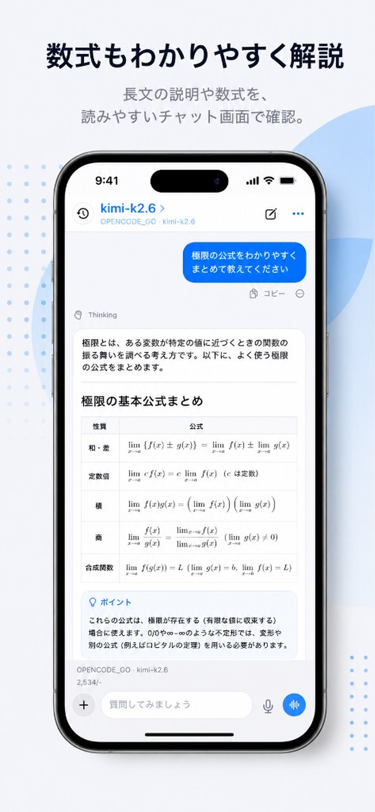
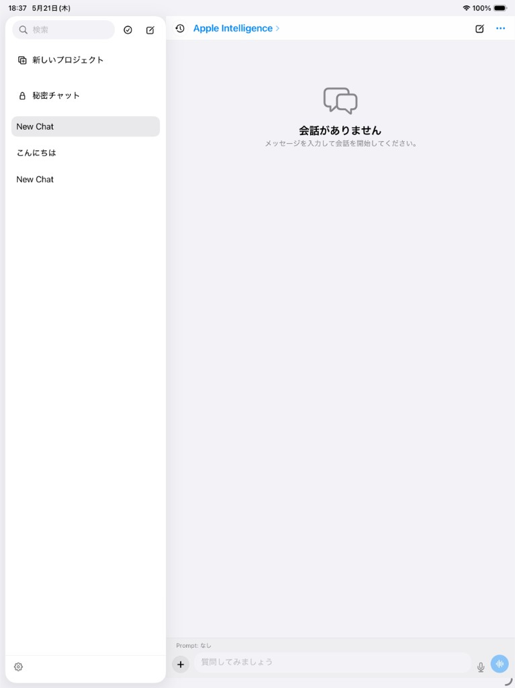

# YamabikoChat

[English](README.md) | 日本語

複数のLLMプロバイダーを切り替え、通常のチャット、2モデルの比較、モデル同士の自動会話を行えるAndroid・iOS向けネイティブAIチャットアプリです。

## 主な機能

- 1対1チャット
- 2モデルの応答を並べて比較するデュアルモード
- モデルAとモデルBが交互に話す自動会話
- 複数の応答を集めて評価するFusionモード
- Markdown・MathJax数式表示
- 画像・PDF・テキスト添付（1ファイル最大10MB）
- 会話履歴、検索、プロジェクト、モデルプリセット
- 任意で利用できるクライアント側Web検索・ツール呼び出し

## スクリーンショット

| iPhone | iPad |
|:---:|:---:|
|  |  |

## プロバイダーとプライバシー

YamabikoChatは、Gemini、OpenRouter、OpenAI、Z.ai、MiniMax、OpenCode Go、xAI/SuperGrok、各種互換APIなど、ユーザーが設定した接続先を利用します。プロンプト、リクエストに含める会話履歴、選択した添付ファイルは、そのプロバイダーへ送信されます。カスタム接続先や追加ツールのデータ取扱いは、それぞれの運営者の規約に従います。

API認証情報は、AndroidではKeystoreを利用する暗号化設定、iOSではKeychainに保存します。機密情報を扱う前に、送信先のプロバイダー、ベースURL、有効なツールを確認してください。

## ビルド

Android:

```bash
./gradlew assembleDebug
./gradlew test
```

iOS:

```bash
cd ios
xcodegen generate
open YamabikoChat.xcodeproj
```

配布用ビルドは [GitHub Releases](https://github.com/porarrirr/yamabikochat/releases) に掲載します。CIで生成したiOS成果物は未署名の場合があり、通常の端末へそのままインストールできるとは限りません。

## ライセンス

独自コードは [MIT License](LICENSE) で公開しています。同梱・復元される第三者ソフトウェアには個別のライセンスが適用されます。詳細は [THIRD_PARTY_NOTICES.md](THIRD_PARTY_NOTICES.md) を参照してください。
