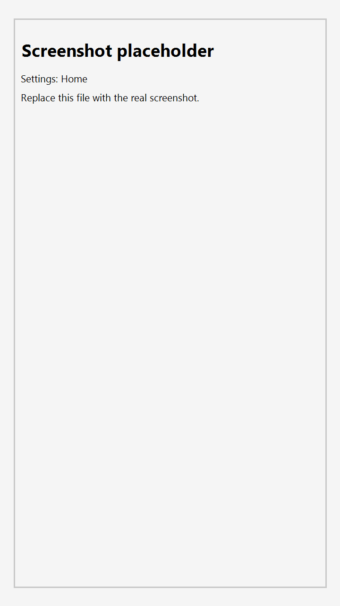
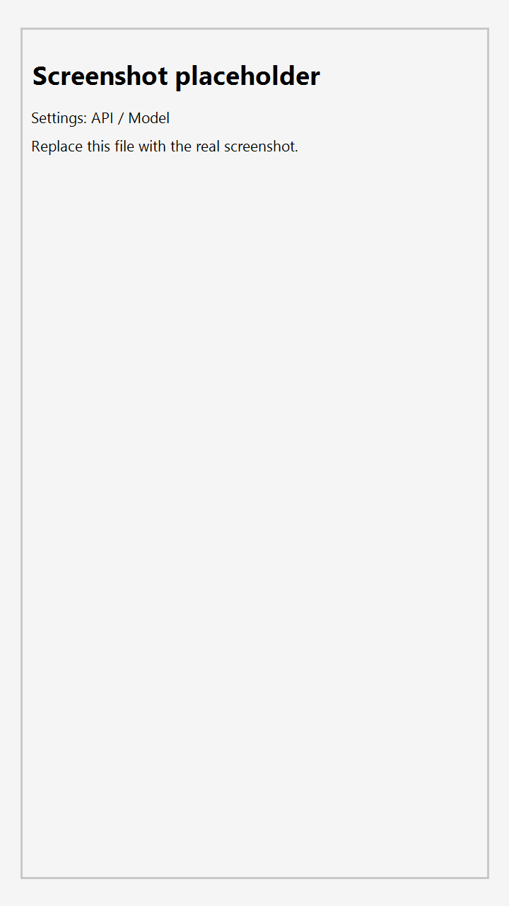
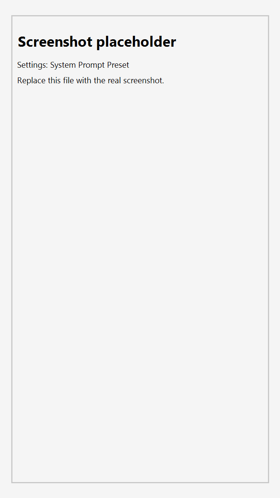
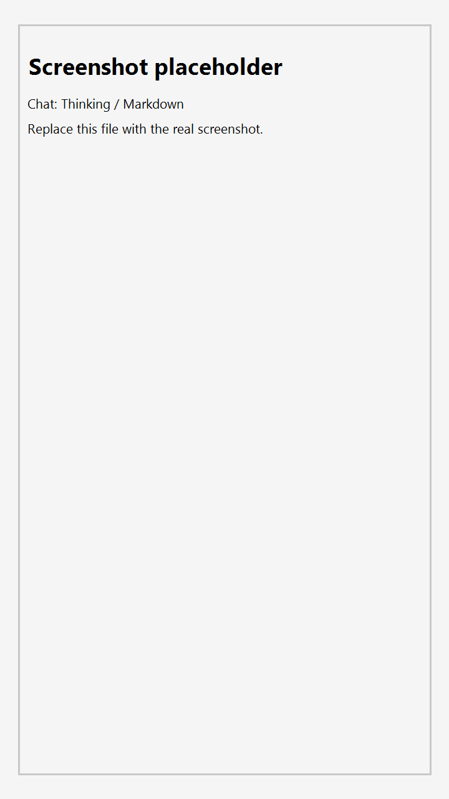

# やまびこチャット (YamabikoChat)

Android向けのAIチャットアプリです。複数プロバイダーのモデルを切り替えながら会話でき、Markdown（数式）表示や、デュアル比較・自動会話にも対応します。

## 注意（免責）
本アプリは Google 非公式ツールです。  
プロバイダー Gemini authを使いGemini 3 Proを使う行為はGoogle の利用規約に違反する可能性があり、アカウント停止や制限を受けるリスクがあります。  
使用に伴う責任はすべてユーザーが負うものとします。  
重要な用途では使用していない Google アカウントでの利用を推奨します。

## Screenshots
| 設定ホーム | API / モデル | システムプロンプト | チャット（Thinking） |
|---|---|---|---|
|  |  |  |  |

## 主な機能
- 1対1チャット（モデル切り替え）
- デュアルモード（2モデルの同時比較）
- 自動会話（モデルA/Bが交互に会話）
- Markdown表示（LaTeX数式・コードブロック・SVGプレビューなど）
- Thinking/Reasoning表示（対応モデルのみ）
- 添付対応（画像/PDF/テキスト、1ファイル最大10MB）
- 共有メニュー連携（選択テキストを「やまびこチャットで質問/翻訳」）
- 外観（テーマ/カラー、Dynamic Color）

## セットアップ（使い方）
1. アプリの `設定 → API / モデル` を開きます
2. `API Provider` を選択し、APIキー（または認証）を設定します
3. `Model` に使用するモデル名を入力して会話を開始します

### 対応プロバイダー
- Google Gemini
- OpenRouter
- OpenAI（OpenAI互換Base URLも含む）
- Z.ai

### APIキーの保存について
- APIキー等は原則として暗号化ストレージ（`EncryptedSharedPreferences`）に保存します。
- 端末/環境によって暗号化ストレージが初期化できない場合、フォールバックのPreferencesに保存されることがあります（この場合、暗号化されません）。

### Gemini Tools
`設定 → API / モデル` から、Gemini向けのツールを切り替えられます。
- `Google Search`: 最新情報の参照に使います
- `URL Context`: URLを参照してコンテキストを取得します

## システムプロンプト
`設定 → システムプロンプト` から、会話に適用するシステムプロンプトを管理できます。
- `System Prompt Preset`: プリセット名を入力して保存/更新し、選択中のプリセットとして適用できます
- `System Prompt`: 現在のシステムプロンプト本文を編集します

## デュアル自動会話
`設定 → デュアル自動会話` で、2つのAIモデルが交互に会話するモードを設定できます。
- 2モデル比較や、自己対話的にアイデアを広げたいときに便利です

## 開発
```bash
# デバッグビルド
./gradlew assembleDebug

# 端末/エミュレータへインストール
./gradlew installDebug

# Unit / Robolectric テスト
./gradlew test

# Lint
./gradlew lint
```

## リリースビルド
署名設定が必要です（`local.properties.example` を参照）。
```bash
./gradlew assembleRelease
```

## ライセンス
MIT
