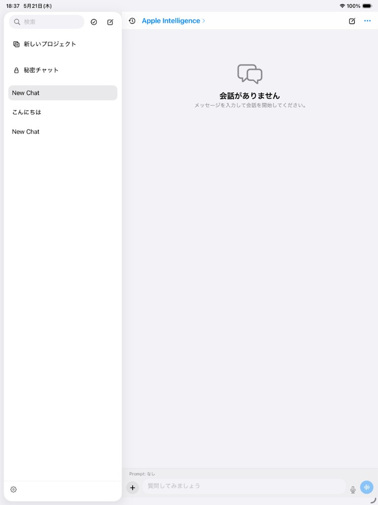

# YamabikoChat

English | [日本語](README.ja.md)

A native AI chat app for Android and iOS that lets you switch between multiple LLM providers, compare two models side by side, and run automatic model-to-model conversations.

## Highlights

- Standard one-to-one chat
- Dual mode for comparing two model responses
- Automatic conversations between model A and model B
- Fusion mode for collecting and evaluating multiple responses
- Markdown and MathJax rendering
- Image, PDF, and text attachments up to 10 MB per file
- Conversation history, search, projects, and model presets
- Optional client-side web search and tool calling

## Screenshots

| iPhone | iPad |
|:---:|:---:|
|  |  |

## Providers and privacy

YamabikoChat connects to the provider you configure, including services such as Gemini, OpenRouter, OpenAI, Z.ai, MiniMax, OpenCode Go, xAI/SuperGrok, and compatible APIs. Prompts, the conversation context included in a request, and selected attachments are sent to that provider. Custom endpoints and optional tools follow the data-handling terms of their respective operators.

API credentials are stored with Android Keystore-backed encrypted preferences on Android and Keychain on iOS. Before using sensitive content, confirm the destination provider, base URL, and enabled tools.

## Build

Android:

```bash
./scripts/bootstrap-pi-runtime-android.sh
./gradlew assembleDebug
./gradlew :app:testDebugUnitTest
./gradlew :app:connectedDebugAndroidTest
./gradlew -PyamabikoTestBuildType=diagnostic :app:connectedDiagnosticAndroidTest
```

The Android bootstrap restores NodeMobile for all bundled ABIs and builds Pi from
the shared, locked dependencies in `ios/PiRuntime`. Connected tests require an
Android device or emulator and verify the packaged Pi runtime without API keys.

iOS:

```bash
cd ios
./bootstrap.sh
open YamabikoChat.xcodeproj
```

Builds intended for distribution are published on [GitHub Releases](https://github.com/porarrirr/yamabikochat/releases). CI-generated iOS artifacts may be unsigned and are not necessarily installable on a normal device.

## Repository layout

| Location | Purpose |
|---|---|
| `app/` | Android app and tests |
| [ios/](ios/README.md) | iOS app, tests, and build tooling |
| [ios/docs/](ios/docs/README.md) | Development notes and design QA evidence |
| `scripts/` | Shared runtime bootstrap and provider contract checks |
| [docs/](docs/README.md) | Public website and legal/support pages |
| `third_party/` | Third-party contracts and notices |
| `gradle/` | Android build dependencies and wrapper |

Local reference clones belong in `.local/reference-repos/` (ignored by Git).
Build caches and restored dependencies remain in the locations expected by the build tools.

## License

Original project code is available under the [MIT License](LICENSE). Bundled and restored third-party software remains subject to its own terms; see [THIRD_PARTY_NOTICES.md](THIRD_PARTY_NOTICES.md).
